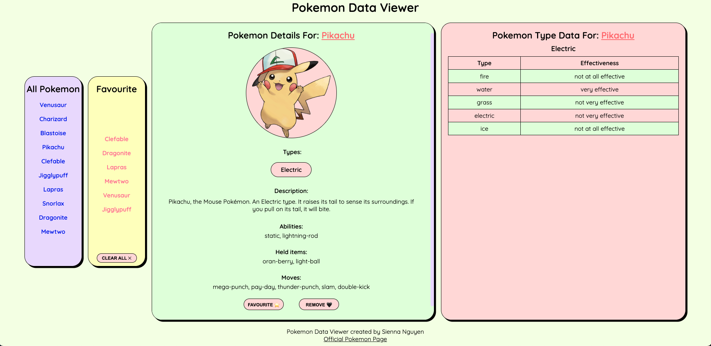

<h1>Pokemon Exploration Website</h1>

This web project is to create a single-page application that dynamically displays data about Pokémon. The application utilizes AJAX for dynamic loading of data from the server without refreshing the entire page. It aims to demonstrate proficiency in client-side and server-side JavaScript development while adhering to good coding practices and design principles.

<h3>Key features</h3>
<ul>
<li>Responsive Design: The web page layout adjusts to different screen sizes, with a maximum of 3 columns for wide screens and a single column layout for smaller screens.</li>
<li>Server-side Route Handlers: Implement route handlers in the web-assignment-pokemon.js file to handle AJAX requests and respond with JSON data. Route handlers include functions to get Pokémon by name, retrieve all Pokémon names, get Pokémon type by name, and fetch random Pokémon data.</li>
<li>Client-side Code: Develop client-side HTML, CSS, and JavaScript to dynamically fetch data from server-side route handlers and display it on the page. The client-side code should handle events such as page loading, Pokémon selection, and interaction with Pokémon types.</li>
<li>Unique CSS and Design: Customize the design of the web page using colored backgrounds, non-standard fonts, and a carefully chosen color palette. Employ CSS properties such as rounded corners, transitions, and animations to enhance the visual appeal of the page.</li>
<li>Favourites Feature with Client-side Storage: Implement a feature allowing users to add Pokémon to their favorites list. Utilize client-side storage technologies like cookies, local storage, or session storage to persist user favorites across browser sessions.</li>
<li>Third-Party API Integration: Augment the site with data from a third-party API, specifically the PokeAPI. Fetch additional Pokémon-related data from the PokeAPI and display it on the page alongside existing content.</li>
</ul>